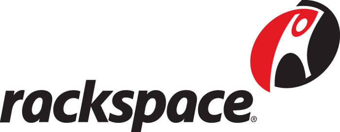

<!SLIDE title-slide>
.notes You are not an imposter. What you have to say is important. John and I are here today to talk about a project we're working on with the Ontario Council of University Libraries; OCUL represents the 21 university libraries in Ontario, Canada. The project is not officially off the ground yet, but nearly there. We had hoped to give a little more, stuff like what we're going to talk about doesn't come in over night. This is TOTALLY NOT VAPORWARE.

# Strong and Free:
## _Building a Resilient Data_
## _Store North of the Border_

Nick Ruest, York University

John Fink, McMaster University

!SLIDE center
.notes Little bit of an overview here. What I am going to do in my portion of the presentation is go over some background info and try and provide some context at the same time. Then a little bit later, I'll finally get to what we are trying to do. After that, John is going to get into the technology stack, and all the great stuff behind that.

# Overview

### Background

### Context

### What we're trying to do

### Technology Stack

!SLIDE center
.notes What I want to do here is get a show of idea of how and if other folks have begun thinking about this. So, just raise your hands where applicable. Question 1: How much storage do you anticipate needing in 3 years? 10T or less, 10s of T, 100s of T, 10s of P, 100s of P? Question 2: Are your storage needs for large object, small objects, or combination of both? Question 3: Where do you look for storage solutions? Library IT, Campus IT, Partnerships, Commercial?

# Background

I have some questions for *you*!!!

!SLIDE center
.notes I'm going to go a couple of tangents here before I get to the meat of the presentations. So, please bear with me and hopefully this will all make sense in the end. In my first tangent, I'm going to try and convey some broad observations about working in two completely different organizations. I am not trying to say one organization is better than the other, or get up here and pile on McMaster, because I'm not sure how much more they can take. And! In all honestly, I loved the team of folks I worked with there. I just didn't like this one guy.

# What I've learn about two very different organizations

!SLIDE center
.notes You can be really bleeding edge. Jump on every new technology the second it comes out. And maybe even run your production servers on Arch, updating twice a day. Or you can be slow as molasses, overly-cautious to a fault, and extremely conservative; like only upgrading your Wordpress instance one a year. NO! NO! NO! There has to be a balance somewhere in there. Ideally, something with balanced traits: lean, agile, nimble, responsive, adaptive. 

# Movement

!SLIDE center
.notes Ego is so incredibly counter productive. I *hate* *hate* *hate* EGO. Who cares if you are the first to do buy something. Who cares if you were the first to implement something. Don't micromanage, and control access to a team just because you're threatened by other people. What is more import is our community. Our users. Ego gets in the of doing really awesome things, but most importantly it really gets in the way of our values and ethics of our profession, and at the worst of times is a complete disaster.

# Ego

!SLIDE
.notes That whole strengths and weaknesses thing. Organization A is really good at this one thing, but really horrible at this other thing. Organization B is really good at that thing Organization A horrible at, and Organization A really good at that thing Organization B is horrible at. They should totally talk. They should collaborate on this stuff!

# Collaboration

!SLIDE center
.notes Now, time for tangent number two; SUSTAINABILITY!!! Or, where I try to show how I learned how to distill a 105 page report to 5 talking points - Blue Ribbon Task Force Report on Sustainable Digital Preservation and Access. If Dorothea is in the room, I hope I make her proud :-)

# Sustainability

!SLIDE center 
.notes ask audience - how many of you have preservation written into their strategic plan

## _**Recognition**_ of the benefits of preservation by decision makers

!SLIDE center
.notes ask audience - how many of you have a committee, or group that evaluates digitization projects

## a _**Process**_ for **Selecting** digital materials with long-term value

!SLIDE center
.notes ask audience - does your administration (library or university) truly understand the responsibility in stewarding cultural heritage? is there funding available?

## _**Incentive**_ for decision makers to preserve in the public interest

!SLIDE center
.notes ask audience - how many of you have operational conditions for digital preservation (committees, working groups, strategy/implementation plan/plicy)?

## appropriate _**Organization**_ and _**Governance**_ of digital preservation activities

!SLIDE center
.notes ask audience - how many of you have an ongoing budget line for digital preservation?

## mechanisms to secure an ongoing, efficient _**Allocation**_ of _**Resources**_ for digital preservation activities

!SLIDE center

.notes How do those those 5 points look for you at your org? My org looks pretty good on most of them. Since I'm a bit of socialist, and care about my fellow man, what about other folks in the consortia? Wouldn't it be easier to work together in a consortium to take care of this instead of reinventing the wheel locally at each institution?

# Locally or Consortially?

!SLIDE center

.notes When I was back a McMaster we had about 20TB of data that we needed to have a preservation copy stored somewhere. Duracloud/portico, etc where not an option due to cost (I'll speak more to that in a bit). I knew that a Scholars Portal was going through TRAC Certification (trustworthy digital repository), so I asked a colleague there what they were doing for off-site preservation. Long story short, we realized that our "collections" were around the same size, and initially planned on mirroring our content at each institution. From there (after talking to our bosses about this, it expanded into a conversation into how can we do this cosortially, and we've been working on that ever since.

# Hacking Organizations
## ...or how Nick is incredibly naive

!SLIDE center

# Get to the point man!
## What are you trying to do!?

!SLIDE center
.notes This is a shameless rip-off. Canadian version of the San Diego Super Computing Cloud Storage Services (those rad dudes out at UCSD). Yes we have blessings! We're working with them administratively and technically.

CLOUD.SDSC.EDU

!SLIDE center

.notes We've identified a need to provide archival storage capacity for digitized and born-digital collections. Right now, we have a few options, but they fall between the polar extremes of Glacier (at $10/TB) or DuraCloud using Rackspace or S3 (at $1300/TB). Duracloud/S3/Rackspace are not sustainable as collections grow in size, and Glacier is not sustainable insofar as lacking the ability to audit fixity information in a way that is not cost prohibitive due to bandwidth costs. Moreover, all of these solutions are not within Canadian jurisdiction. We need something that is not susceptible to the Patriot Act and the like.

# Our Context

!SLIDE center

.notes We are now looking at more than 10 years for some libraries engaging in digitization projects, others engaging in mass digitization projects, others acquiring massive born-digital collections of audio and video, and university libraries now engaging in research data archiving. Moreover, long-term preservation of digital content requires active management, which requires facilities for storing digital content online, monitoring its fixity, and migrating to new formats over time.

# Our needs

### Small digitization projects
### Mass digitization projects
### Purchasing or accepting large born-digital donations
### Research data

!SLIDE center

# BACKUPS 
# != 
# DIGITAL PRESERVATION

.notes This is something I seemingly have to combat over and over again on the hard IT and administration side of things. Backups are NOT digital preservation. Let's say that one more time. BACKUPS ARE NOT DIGITAL PRESERVATION. Backups are a part of digital preservation, but have a backup is not digital preservation. I will repeat myself one more time, Long-term preservation of digital content requires active management, which requires facilities for storing digital content online, monitoring its fixity, and migrating to new formats over time.

!SLIDE center

# Storage Hierarchies

!SLIDE center

.notes Print libraries have used a hierarchical model for storing content for many years. High use material is kept on reserve. Core collections are kept in stacks close to users, and low-use material are kept in off-site storage facilities. Storage requirements for digital libraries similarly map to hierarchical terms as well. In this generalized graphic, we have high-availability services (indexes and transactional databases) at the top, beneath that we have we have content that researchers and students use on a daily basis (journal articles, eBooks, and other published resources), then at the bottom we have tape storage services that provide high-capacity, low-cost replication, and off-site distribution of the data with very lengthy retrieval times.

!SLIDE center
.notes Yep, I totally skipped over one. Archival storage of digital objects requires storage with very high-capacity, mid-range retrieval speeds, all at a low cost. This type of storage is generally very difficult for libraries to acquire. It is not normally available through central IT, and the commercial options have lots of drawbacks. Let's see what our options are.

!SLIDE center
.notes S3 is Amazon's established service for high availability cloud storage. If I decided to use S3 for that 20TB collection I mentioned earlier, I'd be looking at a $85k/yr bill. In the context of dark archiving, Glacier is of great interested with its $10/TB price point. But, it is a mostly untested service for archiving digital objects given the bandwidth costs. For example, to perform fixity checks once a year on 150TB, it would cost approximately $27,000.

!SLIDE center
.notes Rackspace is a cloud services company that provides services very similar to Amazon AWS, and mimics Amazon's APIs. Pricing is very similar to Amazon's S3 services - so, something like that $85k/yr price point for the 20TB collection. Currently they do not offer a comparable service to Glacier.

!SLIDE center
.notes Backblaze is a low-cost backup service designed for individual consumers. As a consumer solution, it is not a viable option for library archiving needs. Their price point of $4/month for unlimited sets is very appealing, but the service is tied to a single MAC address.

!SLIDE center
.notes DuraCloud resells space from Amazon S3 (I believe Glacier now), Rackspace, San Diego Supercomputer Centre (see where we're going with this :-) ). It adds digital preservation & management tools and increased levels of redundancy. Currently their prices range from $1,300 to $6,900 per terabyte depending on volume and options.

!SLIDE center
.notes Portico has been discussing, for several years, the viability of offering archival services for locally created content in addition to their existing role as an archive for publishers' output. The last update to the project that I am aware of was published on the Portico site in 2009. So, none of these look very appealing once you take a good hard look at them. Oh yeah, they're all American too. :-) So, what are we to do?

!SLIDE center

# Community Storage Clouds

.notes Private or community based storage clouds are what we're looking at as an alternative to commercial cloud services. By using an open source stack like Openstack (which John will talk about more in a bit), we would not be tied to a particular hardware vendor, thereby allowing us to build our own solution with commodity hardware. Some more advantages include: reducing bandwidth charges, and allowing us to maintain physical control over hardware.

!SLIDE center
.notes COMPONENTS (read the points): 1) off-the-shelf storage arrays using consumer-grade disk drives 2) middleware takes care of replication and automatic restoration of data from failed disks 3) routing data across geographic areas 4) Openstack API which is basically the S3 API 5) Remote management -- web based interface for users/institutions 6) scale out to 100s of petabytes 7) Now over to John to talk more about a potential hardware and software solutions.

# Components

### Commodity hardware
### Middleware replication and restoration
### Geographic diversification
### Block and object storage using a common API
### Remote management
### Scalabiility
