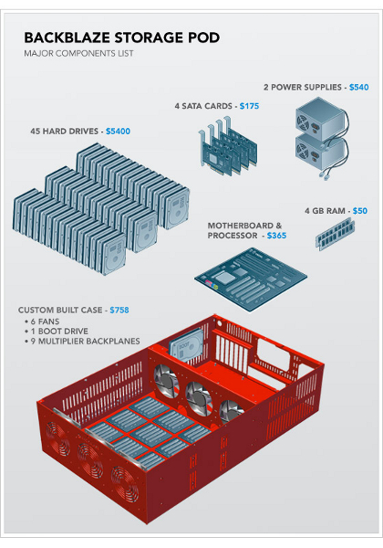
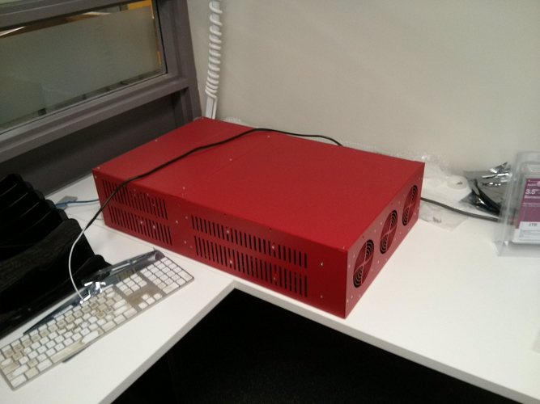
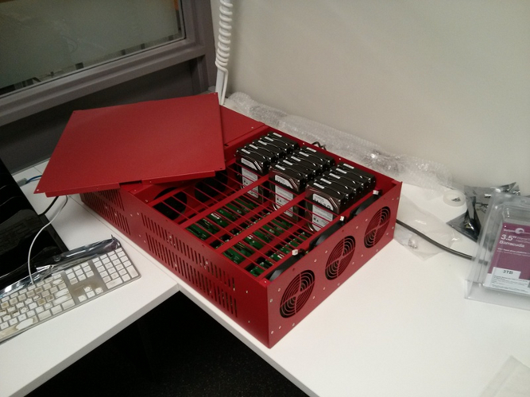

<!SLIDE center>

<!SLIDE center>

.notes So this company Backblaze, which is itself a cloud hosting provider ala Dropbox, Amazon etc. etc., did something sort of amazing. They engineered a relatively-super cheap box that is designed to be populated with cheap-ish desktop drives.  *Then* they released the design of the box for free for anybody to implement. Think open source software, but for hardware, like an Arduino. The cheapness of this allows them to treat the entire box as a FRU, so they have a chunk of them sitting around and when one box fails they can slide in another.

<!SLIDE center>

.notes So here's a picture of the pod we have. It has 45 bays, of which we are currently using 15, but we plan on maxing out to 45 in production. At 3TB each, that gives us 135 TB of storage of a price at about $10k, compared to (I think?) $2 MILLION over three years for comparable storage on Amazon S3. The drives are nothing special, they're all just whatever you'd have in your desktop. This allows us to cut costs by big chunk by not buying "server ready" type drives. All it basically is is a normal desktop PC with a ton of drives in it and a bunch of sorta-redundant power supplies and fans and such. Turning it on sounds like a jet engine, so you don't want to have this on your desktop. It's a straight x86 machine, so whatever Linux or so you want to shove in it will work. Dig those rubber bands around the drives -- those are shock absorbers! 

<!SLIDE bullets incremental>

# What is OpenStack?
* "Infrastructure as a Service"
* "...massively scalable cloud operating system..."
* ... oh god the cloud

.notes ask if people are confused. Ask if people are sick of the cloud yet. It's IaaS! What's IaaS?

<!SLIDE bullets incremental>

# With a local OpenStack you could...
* ... easily spin up server space for projects
* ... do that fun Big Data stuff you've heard about
* ... do lots of backups

.notes This might be a bit out there for most of us -- hard to think of use cases where you'd need be your own Amazon. But but but, in universities -- especially in universities without a heavy STEM or comp sci contingent -- there's a real possibility that the library can fill a role for computing infrastructure. As we move more and more into things that take a *lot* of space -- digital objects -- having large storage arrays locally makes more sense.

<!SLIDE>

# OpenStack Swift

.notes We're primarily interested in Swift, which is the OpenStack S3-Alike. It's a massively scalable system in which files can be written to multiple spread out servers -- think a RAID array writ large. Most implementors of OpenStack Swift will have lots and lots of bricks. We're looking at two per site for three sites initially, in fitting with the FRU-able nature of the Backblaze pods.

<!SLIDE>

# How OpenStack Swift (and S3, and etc) differs from traditional storage

<!SLIDE bullets incremental>

# Traditional storage:
* A drive (or logical group of drives)
* Namespace similar to existing (C:, /home)
* Not easily expandable/adjustable

<!SLIDE bullets incremental>

# OpenStack/swift/S3
* *Not* mounted as traditional drive
* Can be grown/shrunk more easily than, say, a RAID array
* exists 'out there'
* Is addressable via a REST interface

.notes This requires a *huge* change in how crusty old people like myself think about drives and storage. When I think storage, I think ok, I have /home or /tmp or whatever and I deal with it using UNIX commands like mv or cp. But for programming languages, this is less than ideal -- OpenStack and other RESTful things are not meant for *people* to be futzing around but programs, and it's much easier for someone to, say, write a Rails app that talks to OpenStack than to write one which has to write to a drive in the way we usually think about writing to drives.
